# CISC121_Project_Binary_Search

# Binary Search
I chose binary search because it is an elegant searching method that has a worst-case time complexity of just O(log n). It is one of the most useful methods to search through a sorted list. It can be a list of numbers or anything that can be sorted.
The binary search algorithm repeatedly divides a sorted list in half (usually rounding down) looking for a target:
- It checks the middle value for the target value
- If the target is larger, searches the right half by moving the left pointer 1 index right of middle
- If target is smaller, searches the left half by moving right pointer 1 index left of middle
- Repeats until target found or until exhuasted and there is no target

## Demo video/screenshot of test
### Testing
- Target Found (2 images stitched together)
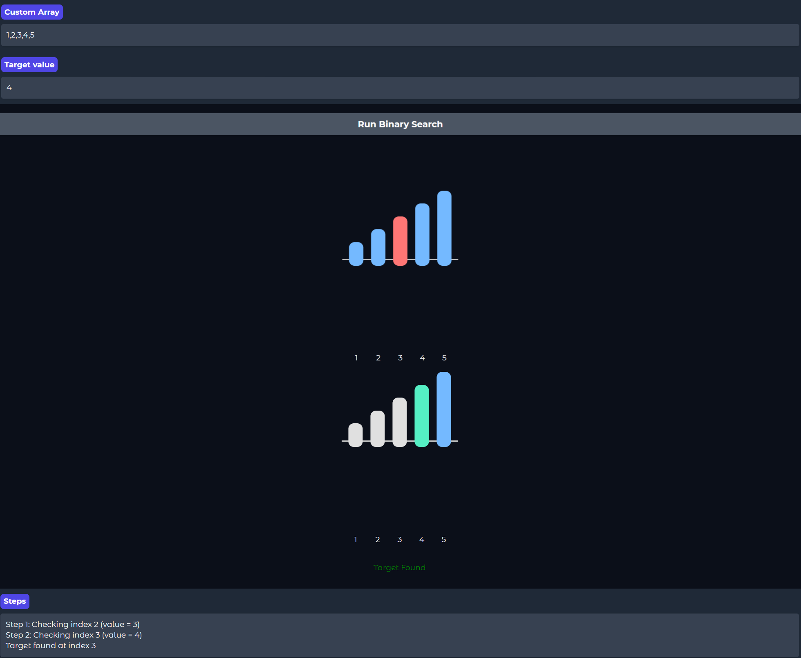
- Target Not Found (2 images stitched together)
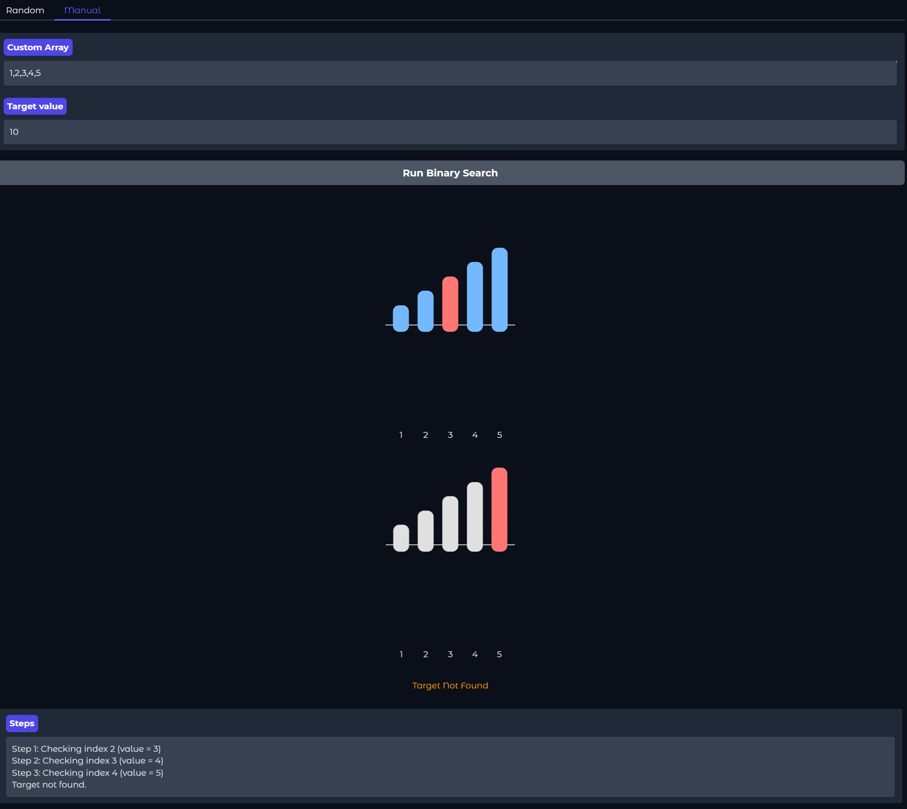
- Hidden Array Test (2 images stitched together)
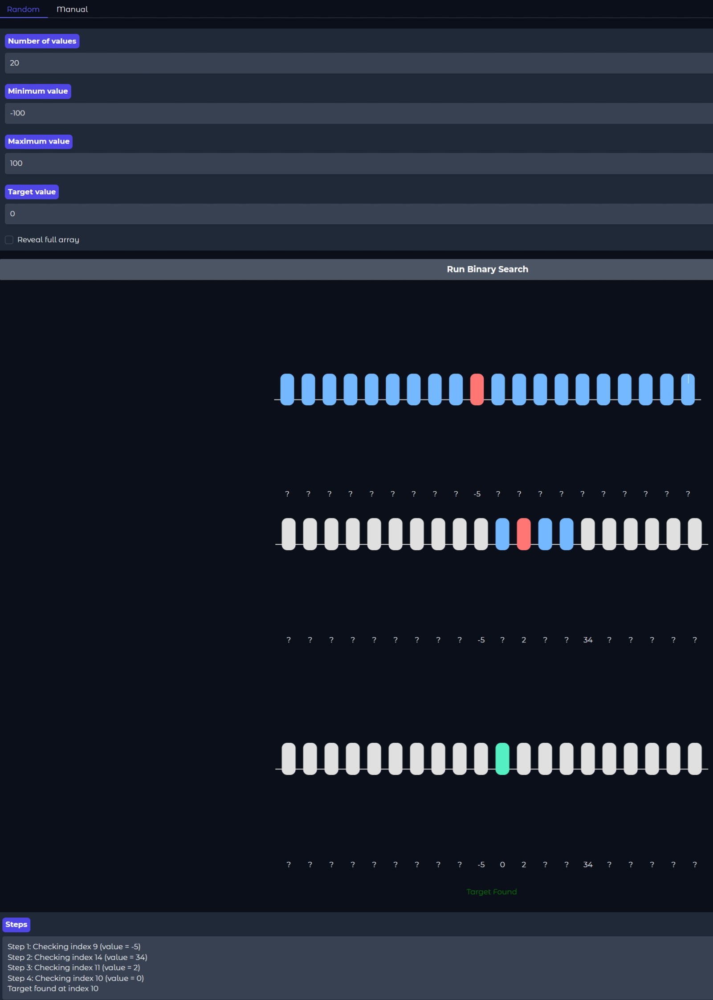
- Many Elements in Array Test
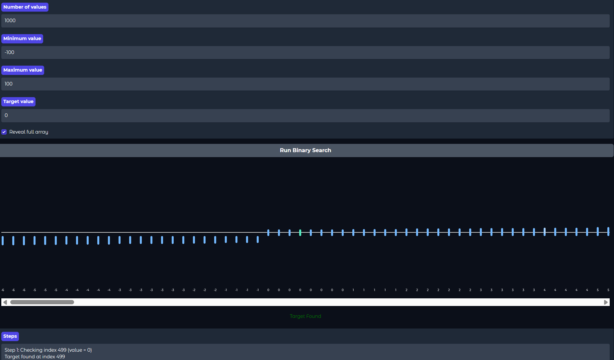
- Single Array Test Manual
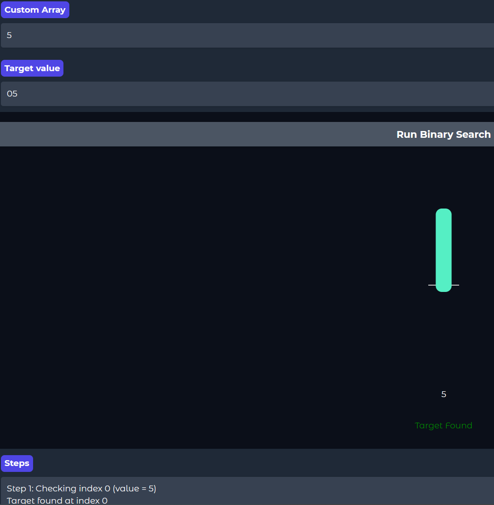
- Letter Error
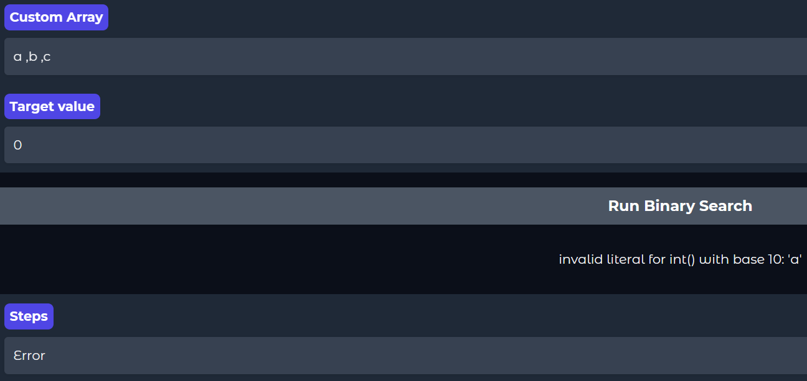
- Decimal Number Error
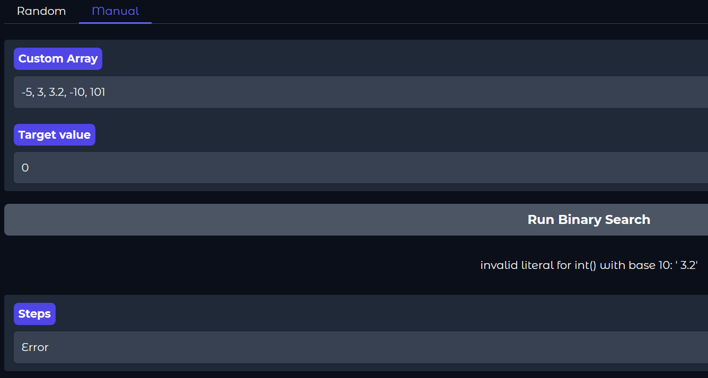
- Comma/Space/Null in Array Error
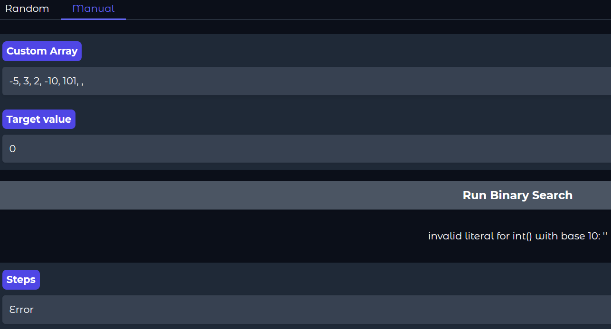
- Negative Number of Values Error 
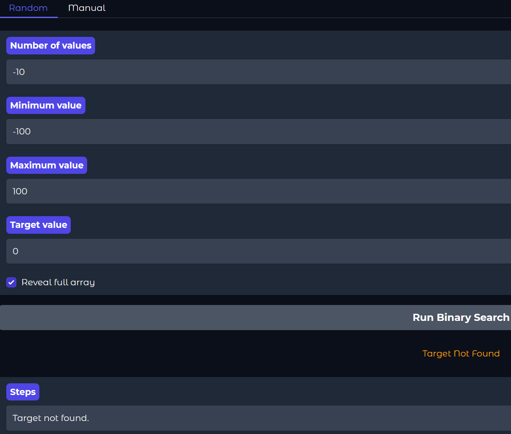
- Empty Array Error Manual
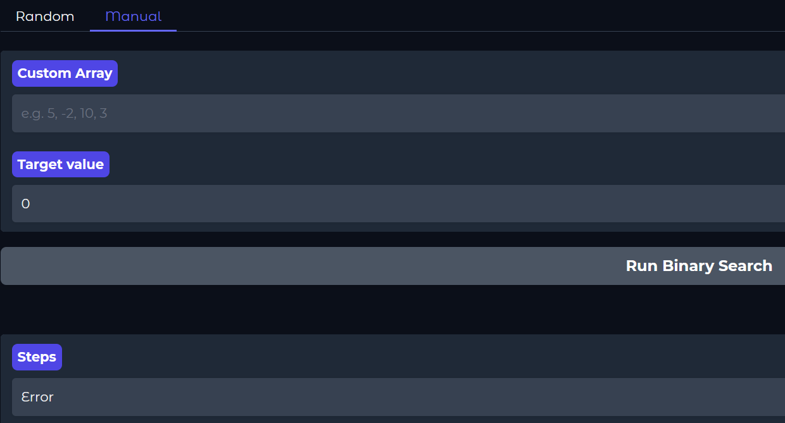
- Empty Array Error Random
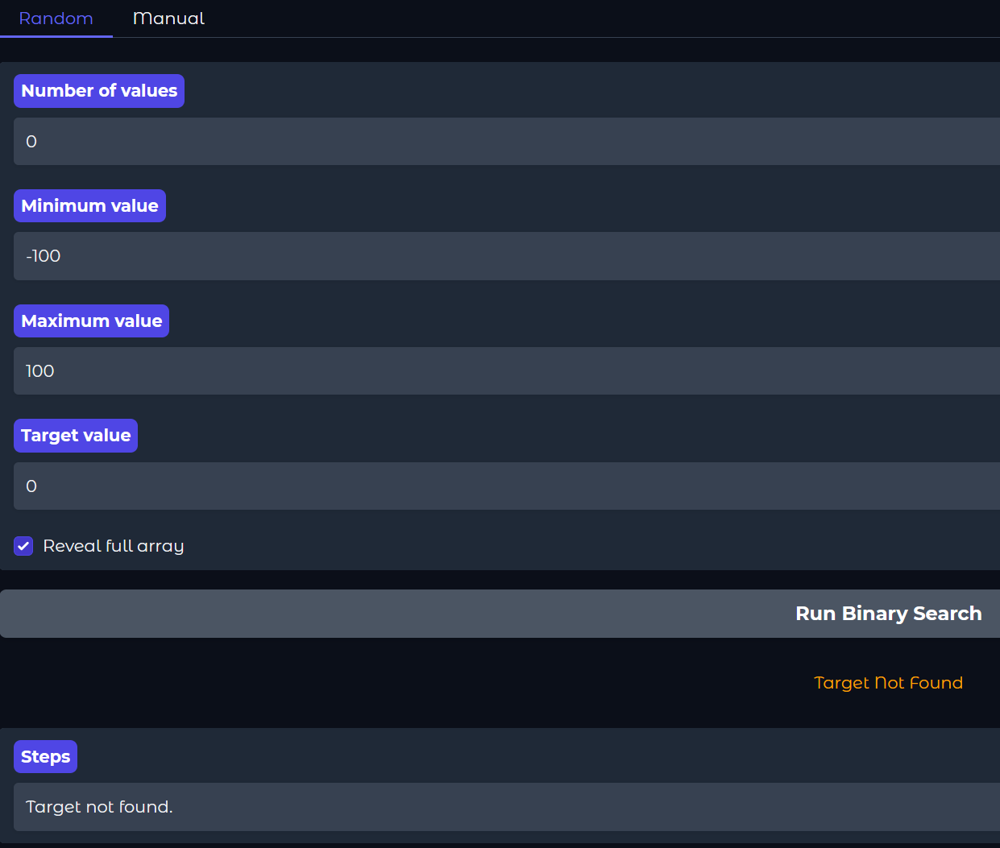

### Features
This project is an interactive visualization tool that demonstrates how the binary search algorithm works step-by-step. Users can either generate a random sorted array or input their own custom array, and observe how the algorithm narrows down the search range.
- Visual step-by-step binary search
- Random array generation with adjustable bounds
- Manual array input
- Highlighted midpoint and search range
- Negative values displayed downward
- Found target highlighted in green
- Optional hidden array mode (progressive reveal)

## Problem Breakdown & Computational Thinking
### Decompisition 
- Instead of searching through a large sorted list linearly, binary search involves breaking the list into smaller sections, a lower half and upper half.
- The problem is reduced iteratively. If the target is not in the middle, you search the remaining half.

### Pattern Recognition
- Recognizing that the data is sorted allows the algorithm to skip large parts, patterns like 'divide and conquer'.
- With a repeated structure, use that logic. Finding the middle, comparing the target, and splitting the array. This repeating in every step lets us make a loop or recursive function.

### Abstraction
- Focus only on the middle, lower bound, and upper bound to find the next search range.
- Ignore values in the discarded half and use a general model to pick which half to search, like target < mid means search left, which works for any sorted list regardless of size.

### Algorithm Design
- Using two different modes, the user will control the inputs. In 'Random' mode, the user will choose the bounds and number of elements for a sorted random array, also choosing the target. In 'Manual' mode, the user will input the array and the target. The program will then sort the random array or user array. It will iterate through the array and either find the target or not, using the binary search shown above. It will then output how many steps it took as well as which values and indices it checked. This output will be visual and written.


## Steps to Run
Download the files in this repository. Then:
In Bash, you can 

```
pip install gradio
```

then run 

```
python app.py
```

Or use the Hugging Face link to access the app (Linked below).

## [Hugging Face Link] https://huggingface.co/spaces/Jawwad3434/Interactive_Binary_Search_Project_CISC121

## Acknowledgment
The code was partly made by Google's Gemini 3 Flash AI LLM using prompts I gave to it. 
